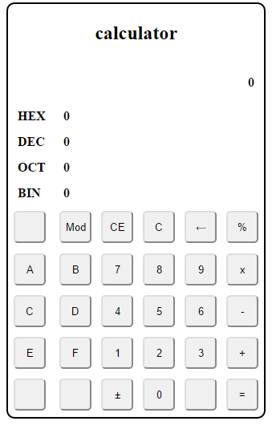
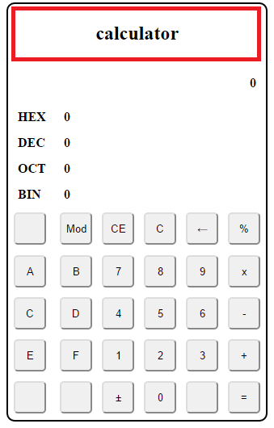
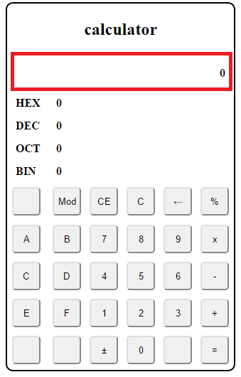
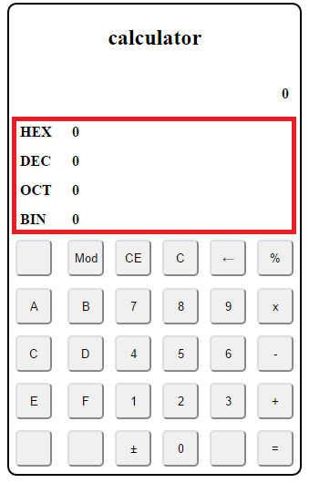
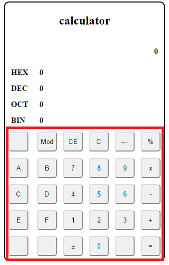
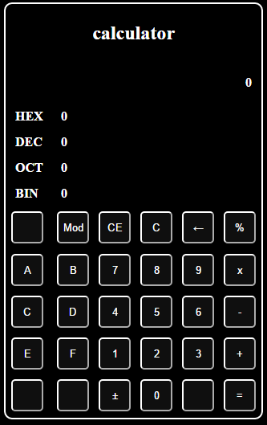

# Softdev hw1

In this homework, we are going to build a simple calculator!

# Grading policy

- Title text should be `Calculator` [10]

- Favicon [10]

- Header of calculator [5]

- Answer of calculator [5]

- Decimal convert list [20]

- All the other buttons [30]

- Two different color themes [20]

 

**Please using git branch to create different color theme**

